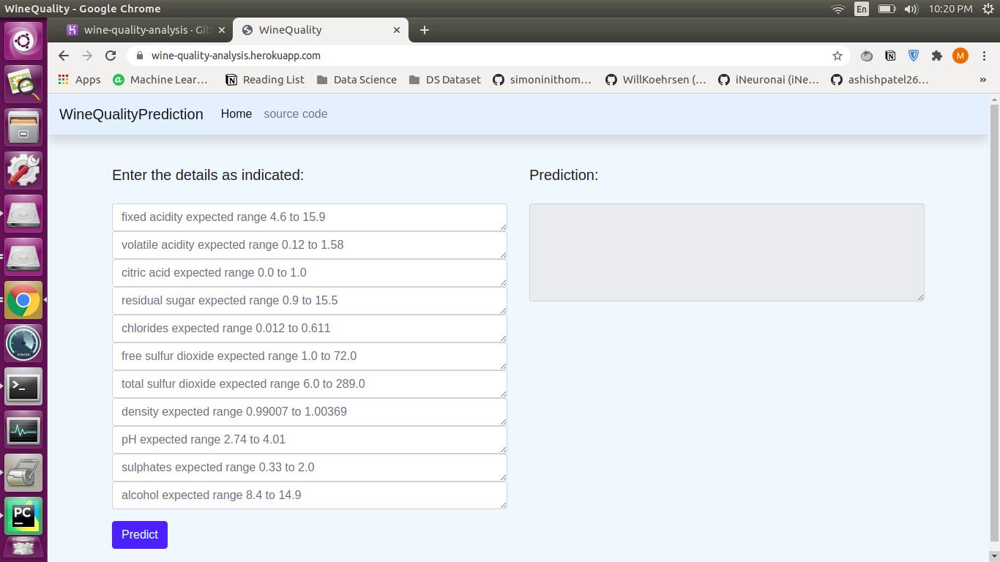

create env 

```bash
conda create -n wineq python=3.7 -y
```

activate env
```bash
conda activate wineq
```

created a req file

install the req
```bash
pip install -r requirements.txt
```
download the data from 

https://drive.google.com/drive/folders/18zqQiCJVgF7uzXgfbIJ-04zgz1ItNfF5?usp=sharing

```bash
git init
```
```bash
dvc init 
```
```bash
dvc add data_given/winequality.csv
```
```bash
git add .
```
```bash
git commit -m "first commit"
```

oneliner updates  for readme

```bash
git add . && git commit -m "update Readme.md"
```
```bash
git remote add origin https://github.com/coolmunzi/webapp_mlops.git
git branch -M main
git push origin main
```
Add/ Update stages:
1. **get_data.py**: Involves data capture from csv files and create dataframe 
2. **load_data.py**: Load the captured data, process it and store the processed data as csv file
3. **split_Data.py**: Splits the total dataset into training and testing chunks
4. **train_and_evaluate.py**: Train the model and evaluate the model performance 

Update stages in dvc.yaml

Add all stages to dvc for tracking
```bash
dvc repro
```

To see the model evaluation metrics from dvc
```bash
dvc metrics show
```

If you change the hyper parameters and later on would like to compare the hyper-parameters os all experiments
```bash
dvc metrics diff
```

Add/update testing files: __init__.py, conftest.py, schema_in.json and test_config.py inside tests directory
NOTE: Testing can be done using pytest (via pytest -v) or using tox.

Create schema_in.json indicating min and max values for all the columns using following command:
```bash 
import pandas as pd
df = pd.read_csv('data_given/winequality.csv')
overview = df.describe()
overview.loc[ ["min", "max"] ].to_json("schema_in.json")
```
To run mlflow server 
```bash
mlflow server --backend-store-uri sqlite:///mlflow.db --default-artifact-root ./artifacts --host 0.0.0.0 -p 1234
```

To run tests using tox, add/update tox.ini file.

tox command to run tests:
```bash
tox
```
For rebuilding the testing environment when there is change in requirements -
```bash
tox -r 
```
Create setup.py to make package from src. After adding/updating setup.py, execute following command to create src package.
```bash
pip install -e .
```

To build wheel file for src package (Do this if you really need wheel file) 
```bash
python setup.py sdist bdist_wheel
```

For CI-CD workflow, add/update ci-cd.yaml file under .github/workflows which manages github actions

Create a new webapp in Heroku and connect it with your github. Choose Automatic Deploy in Heroku and enable _"Wait for CI to pass before deploy"_. 
Create HEROKU_APP_NAME & HEROKU_API_TOKEN secrets in the github. (NOTE: generate heroku api tokens from applications -> create authorization -> define api token).

This app is deployed on https://wine-quality-analysis.herokuapp.com/ with CI-CD pipeline.

Following image depicts how the deployed app looks like.



